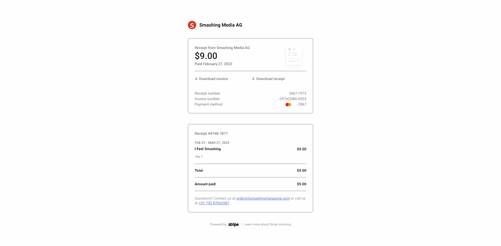

## Table of contents

- [Overview](#overview)
  - [The challenge](#the-challenge)
  - [Screenshot](#screenshot)
  - [Links](#links)
- [My process](#my-process)
  - [Built with](#built-with)
  - [What I learned](#what-i-learned)
  - [Continued development](#continued-development)
  - [Useful resources](#useful-resources)
- [Author](#author)

## Overview

A responsive transactional email with media queries

I have tested the email on 70 plus different devices and email clients. The email works fine in the majority of the email clients.

- Please note this email uses the responsive approach to make emails responsive
- This means it uses media queries to achieve this. Media queries are coded within the style tag in the head tag and although most modern email apps support media queries some don't.
- If viewed in a Gmail app, emails for non-Gmail accounts for example, don't support the style tag and hence no media queries.
- This email will not look responsive if viewed from the Gmail app on Android and Outlook.
- To build emails that is responsive for all environments, including
  the email apps that do not support modern CSS like media queries I use the fluid hybrid approach to responsive email development.
- Please see examples of this approach in my other emails on my website https://www.annie-indreiten.com/

### The challenge

- Creating a transactional responsive email with media queries.
- Most email apps support modern CSS and media queries but as mentioned above this email doesn't work on small screens
  viewed on Gmail apps or Outlook.
- This is a transactional email so I didn't need to use many media queries.
- The email is being made responsive mainly from setting the container of the email to have a width of 100%. I set this as a media query within the style tag

### Screenshot

### Links

- Live Site URL: https://

## My process

- Based on a transactional email I received in my own email inbox
- I optimised and hosted the images online
- I coded the email follwing the CSS2 specificaton, using tables, inline CSS and some media queries to make it responsive
- As it's a transactional email not many media queries were used
  as everything needed to be displayed in one column.
- The best way to approach this type of email is by making the container of the email to be a width of 100% once you are in a smaller screen size than the maximum desktop screen size of 510px, i.e less than 479px
- I used the Desktop-first approach as that's the best practice for email development
- Made it look as good as possible for dark mode
- I tested my email using Email on Acid
- I uploaded the email to the web via

### Built with

- HTML5 markup with CSS2
- An HTML Tag that defines the XML and OOMXML(Office Open XML) which the HTML document needs for the email to work on Outlook on Windows
- An Apple Scaling Meta Tag that prevents any unwanted scaling or zooming from Apple
- An IE9 Meta Tag used for improving rendering in Iternet Explorer 9 or lower
- An XML Tag that ensures that Microsoft Outlook transforms everything in our email to adapt to the screen zoom percentage in Windows
- Inline CSS which is best practice for email as some clients strip out the head tag in emails
- Some media queries within the style tag in the head tag to make the email responsive
- Desktop-first workflow

### What I learned

I learnt how to code a responsive email with media queries and how to test an email for the various email clients

### Continued development

I will continue to improve and practice coding emails!

### Useful resources

I am thankful to Email Geeks, Remi Parmentier of https://www.hteumeuleu.com/, Nicole Merlin and https://www.goodemailcode.com/

## Author

- Website - https://www.annie-indreiten.com/
- Github – https://github.com/AnnieCat73
- LinkedIn - https://www.linkedin.com/in/annie-indreiten777/
